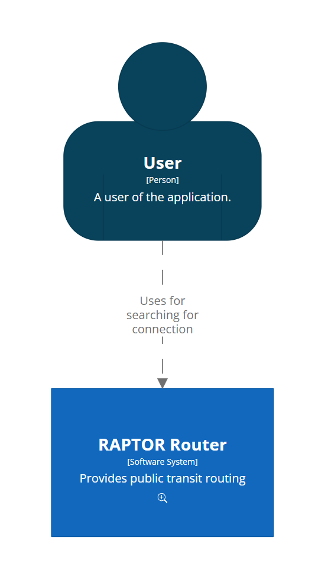
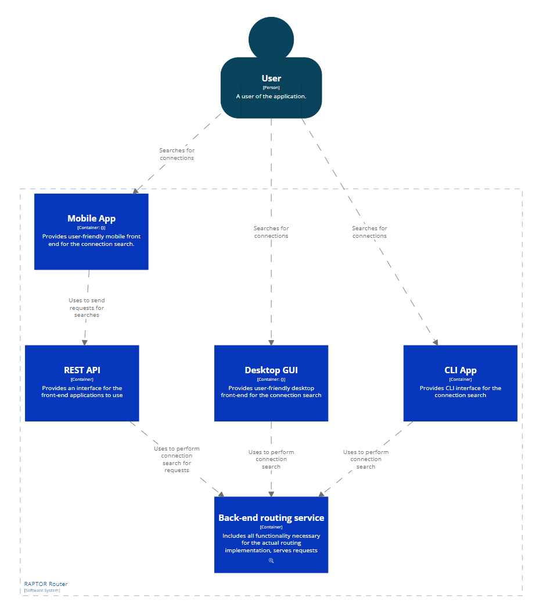
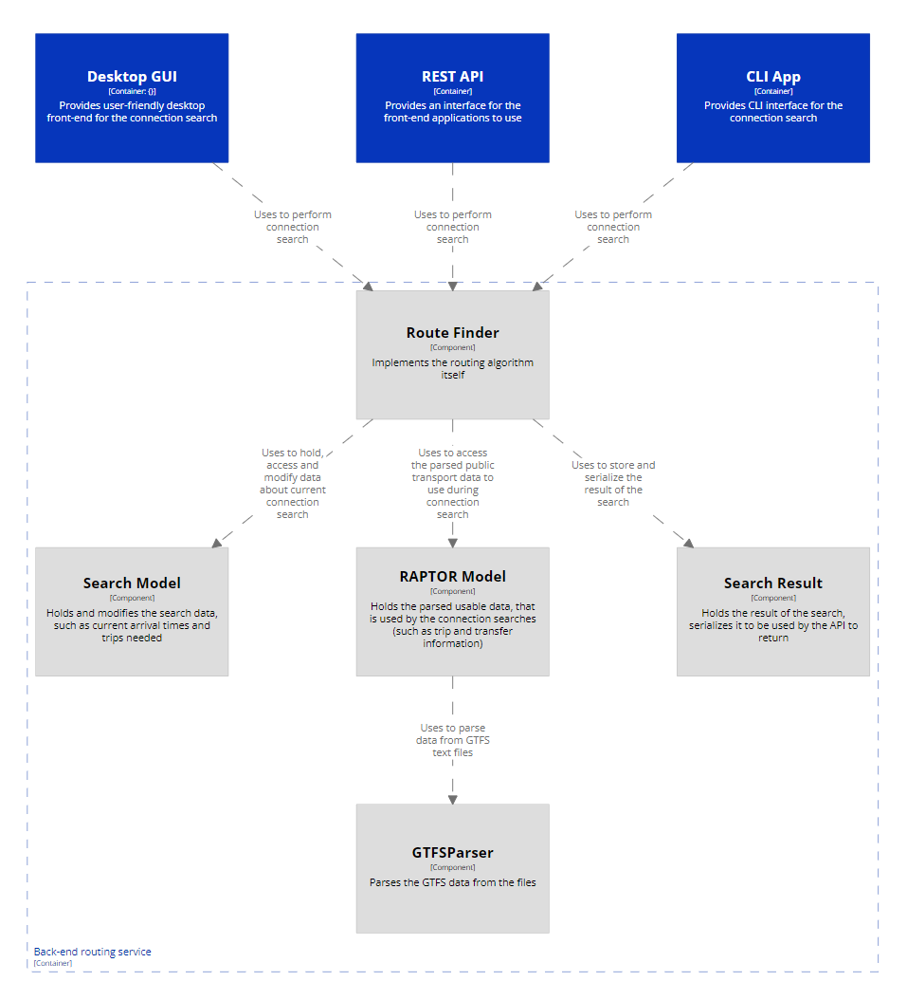

# RAPTOR Router Individual project documentation
## Developer documentation

### Introduction
This document is intended to provide a brief overview of the RAPTOR Router project, and to provide a guide to the codebase for anyone interested in its functionality.

### Project overview
The RAPTOR Router project is an application for searching for public transport connections between two points in a city. It is based on the RAPTOR algorithm, which is a method for finding the earliest arrival times at each stop in a public transport network. The algorithm is described in detail in the [RAPTOR paper](https://www.microsoft.com/en-us/research/wp-content/uploads/2012/01/raptor_alenex.pdf).

### Codebase overview
The codebase is divided into four main parts: the RAPTOR algorithm itself (**RAPTOR-Router** - implementing the functionality of the connection search) and three user-oriented extensions, that use the RAPTOR-Router to provide a command line (**CLIApp**), web (**WebAPI**) and a graphic user interface (**GUI**) for searching for connections. Furthermore there is also a test suite (ConnectionSearchTests) that tests the functionality of the RAPTOR algorithm.

The RAPTOR-Router component itself is further divided into different parts, each of which is responsible for a different part of the algorithm. The main parts are:
	- **GTFSParsing** - responsible for parsing the GTFS data and creating simple raw data structures to be used by the algorithm
	- **RAPTORStructures** - responsible for creating and maintaining the data structures used by the algorithm
	- **RouteFinders** - holding separate implementations of the RAPTOR algorithm - i.e. the actual connection search. Currently only two implementations are available:
		- BasicRouteFinder, that simply fins the connection with earliest arrival
		- AdvancedRouteFinder, that finds the connection according to the parameters specified by the user (e.g. earliest arrival, fewest transfers, shortest travel time, etc.)
	- **SearchModels** - models used by the RouteFinders to store the (intermediate) results of the search

### Typical usage
One of the three possible user-oriented extensions is used to search for connections. The CLIApp is a command line application, that can be used to search for connections from the command line. The WebAPI is a web application, that can be used to search for connections from a web API - i.e. is expected to be used typically for mobile applications. The GUI is a desktop application, that can be used to search for connections from a graphical user interface on windows.

For this overview, we will focus on the GUI, but the other two applications are very similar in their usage.

The typical usage is as follows:
	- The developer first specifies the location of the GTFS data to be used for the connection search. This is done by setting the gtfsArchiveLocation inside the [config.json file](..\\GUI\\config.json).
	- After this the application can be run. The execution works as follows:
		- The GUI Application is started. It first creates a RouteFinderBuilder object. After this it parses the GTFS data location from the configuration file and passes it to the RouteFinderBuilder by calling the LoadDataFromGtfs method.
		- The RouteFinderBuilder then parses the GTFS data into raw data types - i.e. data types, that only hold the raw parsed information from the GTFS files. This means, that the data is not yet in a form, that can be used by the algorithm - only simple types (such as numbers and dates) are parsed into correct data types. The rest (typically foreign object IDs) are left as strings.
		- After this (usually meaning after few seconds), a window is created and shown to the user. The user will now input the parameters of the search - i.e. the departure and arrival locations and times, and the search parameters (e.g. his preferences for the search). After this, the user will click the "Search" button.
		- Now, a RouteFinder object will be created by calling the Create[Advanced]RouteFinder methor on the RouteFinderBuilder. This method will create the data structures used by the algorithm from the raw data types. This means, that the data is now parsed into a linked form, that can be used by the algorithm. The RouteFinder object will then be used to find the connections.
		- Now, the parameters from the user will be parsed into a [Settings object](..\\RAPTOR-Router\\RAPTORStructores\\Settings.cs). This object will be passed to the RouteFinder through calling the FindConection method. This method is where the actual search happens. The RouteFinder will then find the connections according to the parameters specified by the user using the Raptor algorithm.
		- After the search is finished, the results will be returned to the GUI application in the form of a [SearchResult](..\\RAPTOR-Router\\RAPTORStructures\\SearchResult.cs) object. The GUI application will then display the result to the user.

### Remarks to the structures used
- GTFSParsing:
	- The GTFS.cs file holds all the parsed data from the GTFS files.
	- All the other files in this folder are the implementations of data types used to hold the parsed raw data - for example information about one gtfs trip or route.
- RAPTORStructures:
	- Route, Stop, Trip, Transfer and StopTime objects (files) are used for holding the (static) data from the GTFS files.
	- the Extensions.cs file contains extension methods that are handy for working with the data structures.
	- the Settings.cs file contains the Settings class, that is used to hold the parameters of the search.
	- the SearchResult.cs file contains the SearchResult class, that is used to hold the results of the search.
	- the RAPTORModel.cs file contains the RAPTORModel class, that is used to hold all the static data (of the Route/Stop/Trip/... types) in a linked form, that can be used by the algorithm.
- RouteFinders:
	- Advanced- and Basic-RouteFinders are the two implementations of the Raptor algorithm.
	- RouteFinderBuilder is used to create the RouteFinder objects.
	- IRouteFinder is an interface specifying the methods that the RouteFinder objects must implement.
- SearchModels:
	- The SearchModel.cs file contains the SearchModel class, that is used to hold the intermediate results of the search - i.e. one instance of this class will be used for every single search. It is used to hold the dynamic data structures used by the algorithm - i.e. for example the current best found arrival times for every stop, which will change in each round of the algorithm.

### Summary
This concludes the overview of the codebase. 

For more information, please refer to the documentation of the individual classes and methods. The documentation is available inside the codebase itself in the form of documentation comments. It is also available in the form of a a doxygen site that is generated from these comments.

For information about the usage of the GUI, please refer to the [User documentation](user.md).